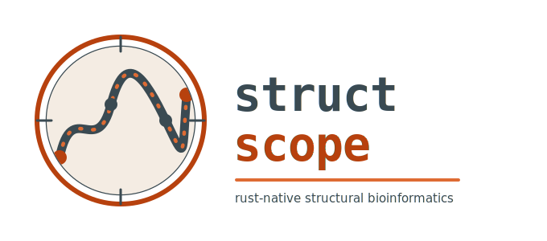

<p align="center">
  
</p>

# structscope

`structscope` is a Rust-native structural bioinformatics toolkit for canonical protein structure parsing, graph-native representations, reproducible feature extraction, and analytical outputs.

This repository currently contains a bootstrap implementation with:

- workspace scaffolding for all planned crates
- crate-backed PDB, mmCIF, and BinaryCIF parsing with gzip input support
- canonical structure normalization
- residue, atom, and interface graph construction (GraphML export)
- structural primitives: solvent accessible surface area (Shrake-Rupley), DSSP-style secondary structure, backbone dihedrals, optimal superposition/RMSD (Kabsch, with optional sequence-alignment correspondence), and typed interactions (disulfides, salt bridges, hydrogen bonds, cation-pi, pi-pi stacking, hydrophobic contacts)
- configurable ligand identification (`LigandFilter` with default denylist and CLI overrides) and protein–ligand features: binding-site residues, cross-boundary interaction counts, and ligand SASA
- protein–protein interface metrics (BSA, interface patch area, Lawrence–Colman shape complementarity) with structure-level aggregates in `featurize` and per chain-pair JSONL via `interfaces`; distance cutoffs via `--interface-distance`, `--interface-area-distance`, and `--interface-sc-distance`
- structure quality checks (Ramachandran favored/allowed/outlier, steric clashes, missing backbone) with structure-level aggregates in `featurize` and per-residue JSONL via `quality`; clash threshold via `--clash-overlap`
- multi-structure compare: pairwise RMSD matrix and feature deltas vs a reference (`compare`), with flexible reference selection and JSON or CSV output
- basic and graph-derived feature extraction, with parallel batch `featurize` via `--jobs` / `-j`
- JSONL and Parquet feature export
- DuckDB-backed SQL querying over feature Parquet (build with `--features duckdb`)
- optional SQLite/JSONL provenance
- CLI entrypoints for parse, featurize, compare, interfaces, ligands, quality, graph, query, rmsd, residues, and provenance

Querying is gated behind a Cargo feature because it bundles DuckDB:

```
cargo build -p structscope-cli --features duckdb
structscope query <features.parquet|out-dir> --sql "SELECT * FROM features"
```

Feature records are exposed to SQL as a `features` table.

Per-ligand JSONL output:

```
structscope ligands complex.cif.gz --ligand-include HEM,NAG --binding-distance 4.0
```

Current limitations:

- the eBPF guard crate is scaffolded only
- `parse` reports raw hetero residue count as `ligands=`; `featurize` uses the filtered ligand definition (see [Changelog](CHANGELOG.md))

## Documentation

- [CLI usage](docs/cli.md) — commands and examples
- [Architecture](docs/architecture.md) — crate layout
- [Changelog](CHANGELOG.md)

